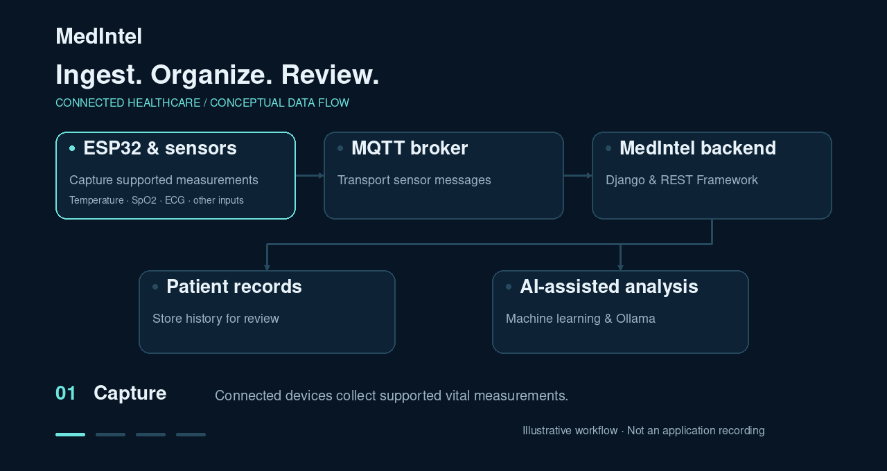

<p align="center">
  
</p>

<p align="center">
  <strong>A connected platform for patient records, vital monitoring, and AI-assisted insights.</strong><br>
  Built with Python, Django REST Framework, and MQTT.
</p>

<p align="center">
  <a href="#overview">Overview</a> ·
  <a href="#capabilities">Capabilities</a> ·
  <a href="#technology">Technology</a> ·
  <a href="#local-development">Local Development</a> ·
  <a href="#contact">Contact</a>
</p>

---

## Overview

**MedIntel** brings patient information, connected measurements, and health data analysis into a single development project. It combines a Django backend with ESP32/MQTT integration to support real-time and historical monitoring, alongside machine learning and Ollama-based explanations.

The project explores how software, embedded devices, and AI can work together to make patient information easier to capture, organize, and review.

## System overview

<p align="center">
  
</p>

<p align="center">
  <sub>Animated system overview based on the project description. This is an illustration, not an application screen recording.</sub>
</p>

## Capabilities

| Area | Project scope |
| :--- | :--- |
| Patient monitoring | Real-time measurements and historical review of patient vitals. |
| Health measurements | Temperature, SpO₂, blood pressure, blood glucose, and ECG data. Available inputs depend on the connected hardware and configuration. |
| Patient records | Patient information, health history, report uploads, and alerts. |
| Doctor & patient workflows | Dedicated doctor, patient, authentication, and appointment template modules. |
| Connected hardware | ESP32 devices and MQTT communication for sensor integration. |
| Machine learning | Symptom-based disease prediction as a project experiment. |
| AI-assisted analysis | Ollama-based health explanations and exploratory ECG analysis. |

> MedIntel is a research and educational project. Predictions and AI explanations require clinical review and are not a validated medical diagnosis.

## Technology

| Layer | Technologies |
| :--- | :--- |
| Backend | Python, Django, Django REST Framework |
| Interface | HTML, CSS, JavaScript, Django templates |
| Persistence | SQL database, configured by the application |
| Device integration | ESP32, sensors, MQTT |
| Machine learning | Symptom-based prediction using a Kaggle dataset |
| AI inference | Ollama; model selection depends on the project configuration |

See [architecture notes](./docs/ARCHITECTURE.md) for the conceptual data flow.

## Local development

The source repository is private; you need access before cloning it.

### 1. Get the source

```bash
git clone https://github.com/ZaidShaikh-2005/MedIntel.git
cd MedIntel
python -m venv .venv
```

Activate the environment:

```powershell
# Windows PowerShell
.\.venv\Scripts\Activate.ps1
```

```bash
# macOS / Linux
source .venv/bin/activate
```

### 2. Install dependencies and configure services

Use the dependency definition included in your checkout and a compatible Python version. If the project provides a root-level `requirements.txt`, run:

```bash
python -m pip install -r requirements.txt
```

Configure the application’s database, MQTT connection, and Ollama integration before starting it. The exact setting names, model files, MQTT topics, and API routes must come from the source.

See the [configuration guide](./docs/CONFIGURATION.md).

### 3. Start Django

From the directory containing `manage.py`, after dependencies and configuration are ready:

```bash
python manage.py check
python manage.py migrate
python manage.py createsuperuser
python manage.py runserver
```

Open [http://127.0.0.1:8000](http://127.0.0.1:8000).

These are standard Django development commands. They have not been tested against this private checkout; any project-specific startup services must also be started as documented in its source.

## Documentation

- [Architecture](./docs/ARCHITECTURE.md) — conceptual device, backend, storage, and AI flow.
- [Configuration](./docs/CONFIGURATION.md) — dependency and service setup.
- [Publishing](./PUBLISHING.md) — upload this README and its assets through GitHub.

## Contact

**Zaid Shaikh** · Software Development, Embedded Systems & IoT

[Portfolio](https://zaidshaikh-2005.github.io/Portfolio/) ·
[Contact](https://zaidshaikh-2005.github.io/Portfolio/contact.html) ·
[LinkedIn](https://www.linkedin.com/in/zaid-shaikh-2oo5/) ·
[GitHub](https://github.com/ZaidShaikh-2005)
