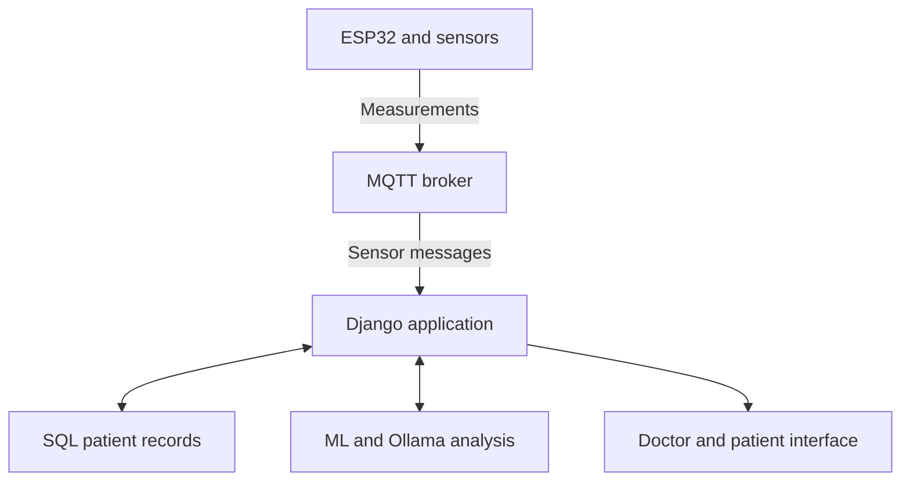

# MedIntel architecture

This is a conceptual overview based on the supplied project description, rather than a verified map of the private implementation.

## Data flow

1. Connected devices capture supported measurements.
2. MQTT carries sensor messages to the application’s ingestion component.
3. The backend associates incoming data with the relevant patient records.
4. Doctor and patient views support review of current and historical information.
5. Machine learning and AI modules provide experimental analysis or explanations.

The actual message schema, MQTT topics, ingestion process, authorization rules, and API routes need to be read from the source before integrating devices.

## Template modules

The repository screenshot confirms these paths:

| Path | Module |
| :--- | :--- |
| `app/templates/app/auth/` | Authentication pages |
| `app/templates/app/doctor/` | Doctor pages |
| `app/templates/app/patient/` | Patient pages |
| `app/templates/app/appointments/` | Appointment pages |
| `app/templates/app/base.html` | Shared page template |

The rest of the repository structure has not been inspected.

## AI evaluation

The project summary reports **91.7% dataset accuracy** for the disease-prediction experiment. This README package does not use that number as a clinical performance claim.

For a reproducible evaluation, document the dataset version, train/test split, preprocessing, model version, class balance, and evaluation metrics alongside the training code. Dataset accuracy alone does not establish performance on new patients.

The supplied summary also names a Kimi/Ollama integration. The specific model tag and runtime requirements should be taken from the implementation.
